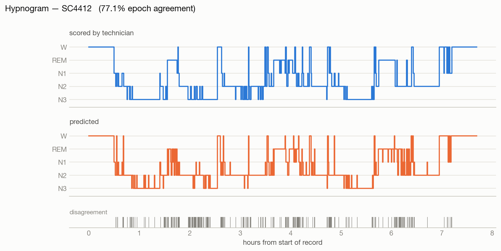

# Sleep Stage Detection from EEG

Five-class sleep staging (W / N1 / N2 / N3 / REM) from single-channel EEG,
using a compact 1D residual network in PyTorch with MNE-based preprocessing.

<picture>
  <source media="(prefers-color-scheme: dark)" srcset="docs/figures/hypnogram-dark.png">
  
</picture>

*A held-out night (SC4412, the median test recording by agreement): technician scoring
above, model prediction below.*

## Model

`SleepResNet1D` — **2,468,099 parameters** (verified: `python3 src/models/sleep_resnet.py`)

- Wide stem (kernel 49, stride 4) to cover low-frequency sleep rhythms, then max-pool
- Four residual stages, widths 34 → 272, stride-2 downsampling between stages
- Global average pooling → 5-way linear head
- Input: one 30 s epoch at 100 Hz = 3000 samples

## Status

| Component | State |
|---|---|
| Model, dataset, metrics, training loop | Working |
| Sleep-EDF preprocessing | Verified against real PhysioNet data |
| Regression tests (`tests/`) | 11 passing |
| **Full 153-recording run** | **Done — both architectures** |

Trained and evaluated on the complete Sleep-EDF Expanded sleep-cassette set:
153 recordings, 78 subjects, 195,469 epochs, split 54/12/12 by subject.

| model | balanced accuracy | Cohen's kappa | accuracy | macro F1 |
|---|---|---|---|---|
| `SleepResNet1D` — one epoch at a time, 2.47M params | 0.7137 | 0.6837 | 0.7639 | 0.7015 |
| `SleepTransformer` — 21-epoch window, 3.01M params | **0.7488** | **0.7229** | **0.7930** | **0.7328** |
| *reference target* | *0.758* | *0.683* | — | — |

Adding self-attention across neighbouring epochs is worth **+0.039 kappa** and
**+0.035 balanced accuracy**, and the gain is concentrated exactly where
theory predicts: N1 **+0.073** and REM **+0.067** F1 — the two stages a single
30 s window cannot disambiguate. N3, the one stage that is unmistakable on its
own, is the only class that gets slightly worse (-0.022).

The transformer clears the kappa target and closes the balanced-accuracy gap
from 0.044 to 0.009. Full breakdown, figures, the imbalance ablation and the
shuffled-label control are in [RESULTS.md](RESULTS.md).

```bash
python3 src/train.py --arch transformer --base-width 24 --seq-len 21 --batch-size 32
```

## Setup

```bash
python3 -m venv venv && source venv/bin/activate
pip install -r requirements.txt
```

## Quick check (no data download)

Generates synthetic recordings with coarse per-stage spectral signatures and
trains on them. Useful for confirming the pipeline runs:

```bash
python3 src/utils/synthetic.py --out-dir data/processed --subjects 16
python3 src/train.py --epochs 4 --num-workers 0
```

The synthetic stages are deliberately easy and the model reaches ~1.00 on them;
this validates plumbing, not sleep-staging skill. The meaningful check is the
negative control — shuffle the labels and the model must collapse to chance:

```bash
python3 src/utils/synthetic.py --out-dir data/shuffled --subjects 16 --shuffle-labels
python3 src/train.py --data-dir data/shuffled --epochs 4 --num-workers 0
```

Measured: balanced accuracy 0.194, Cohen's kappa −0.009 — chance, as it should be.
If this run scores well, there is label leakage somewhere.

## Real data (Sleep-EDF Expanded)

The sleep-cassette set is 153 PSG/Hypnogram pairs across 78 subjects (~7 GB).

```bash
python3 src/preprocessing/download_sleep_edf.py --out-dir data/raw --subjects 20
python3 src/preprocessing/prepare_sleep_edf.py --raw-dir data/raw --out-dir data/processed
python3 src/train.py --epochs 40 --batch-size 128
```

`download_sleep_edf.py` exists because fetching this set from physionet.org is
impractically slow — measured at ~40 kB/s per connection, which puts the full
7 GB at over a day through MNE's sequential fetcher.

It prefers PhysioNet's **AWS Open Data mirror**, which carries byte-identical
files and measured ~1.3 MB/s on one stream and ~2.7 MB/s across six — roughly
**65x** the direct host — and falls back to physionet.org if the mirror fails.
Filenames and SHA1s come from the manifest bundled with MNE rather than guessed
from the naming scheme, which is irregular (`SC4001E0`, `SC4001EC`, …). Every
file is checksum-verified against that manifest, and files already present are
skipped, so an interrupted run resumes.

Omit `--subjects` to fetch all 78 subjects / 153 recordings.

Preprocessing picks the Fpz-Cz channel, resamples to 100 Hz, merges scoring
stages 3 and 4 into N3, and trims to ±30 min of wake around the sleep period —
without that trim the cassette files are overwhelmingly wake.

## Handling class imbalance

N1 is only ~10% of epochs while N2 is ~35%, so plain accuracy is misleading and
the reported metrics are balanced accuracy and Cohen's kappa. Two mechanisms,
both tunable from the CLI:

- `--sampler-scheme sqrt_inverse` — oversamples rare stages during training
- `--loss-weight-scheme effective` — effective-number-of-samples weighting
  (Cui et al. 2019), gentler than raw inverse frequency

## Splitting

`split_by_subject` partitions by **subject**, not by recording. Sleep-EDF gives
most subjects two nights; splitting per-recording would put the same sleeper in
both train and test and inflate results.

## Performance notes (measured on this machine, Apple M-series / MPS)

- **`torch.compile` is disabled off CUDA by default.** On MPS it ran ~50x slower
  per epoch (278 s vs 5.1 s) *and* the model never left chance accuracy.
  Override with `--force-compile`.
- **AMP is CUDA-only here.** bf16 autocast where supported (no GradScaler needed),
  fp16 + GradScaler otherwise. MPS autocast is skipped; CPU uses bf16.
- **`non_blocking=True` is gated to CUDA.** On MPS an async host→device copy could
  be read before it landed, producing garbage logits (absmax ~1e33) on a random
  subset of batches — silent numerical corruption, not a crash.

## Layout

```
src/
├── models/sleep_resnet.py          # SleepResNet1D
├── preprocessing/prepare_sleep_edf.py
├── utils/dataset.py                # subject-wise splits, sampling, weighting
├── utils/metrics.py                # balanced accuracy, kappa, per-class F1
├── utils/synthetic.py              # synthetic data for pipeline checks
└── train.py                        # training / eval entry point
```

## Tests

```bash
python3 tests/test_pipeline.py     # or: python3 -m pytest tests/ -q
```

Eight regression tests, each verified to fail against the code it guards — a
test that cannot fail is not a test. They cover:

- the stage-3/4 event-code collision that rejected every real recording
- exclusion of unscored `Sleep stage ?` annotations
- float32 preservation through normalisation (float64 breaks MPS)
- subject ids parsed from filenames matching MNE's manifest across all 153
  recordings, and splits being disjoint by subject — the two properties that,
  if broken, silently inflate every number in this README
- three metric properties, including that constant-majority prediction scores
  exactly 0.200 balanced accuracy while plain accuracy reads a flattering 0.42

## Metrics

`src/utils/metrics.py` implements balanced accuracy, Cohen's kappa, per-class F1
and the confusion matrix directly in NumPy. Checked against hand-computed values
and behavioural cases: perfect prediction → kappa 1.000; random → kappa ≈ 0;
constant-majority prediction → balanced accuracy exactly 0.200.
