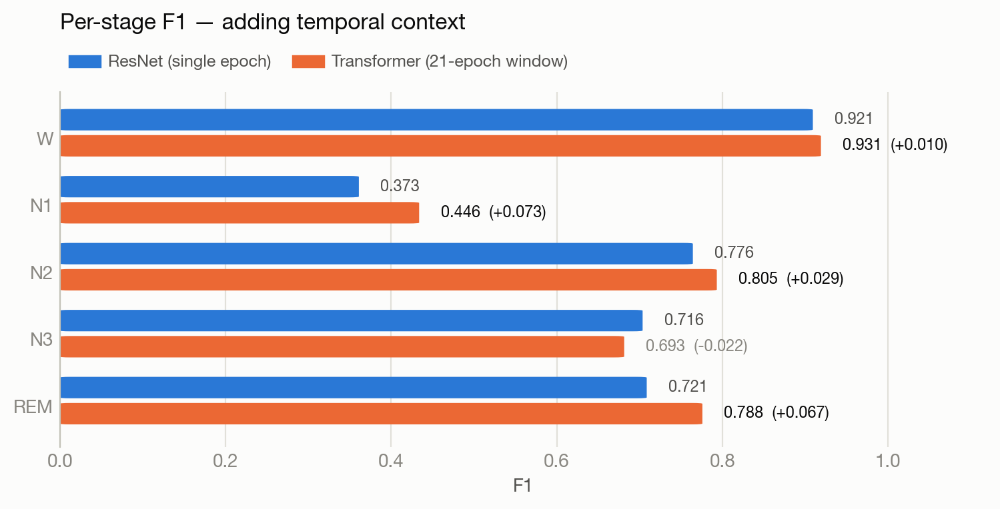
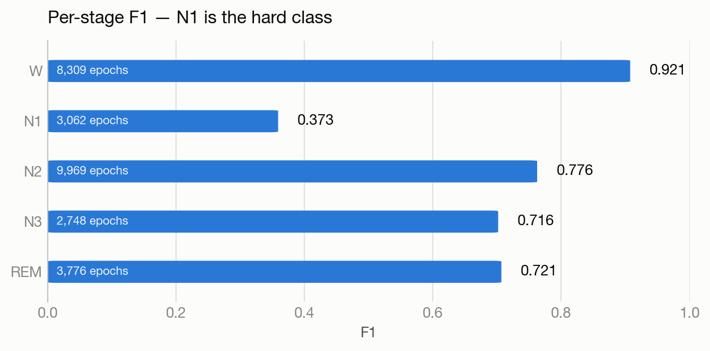
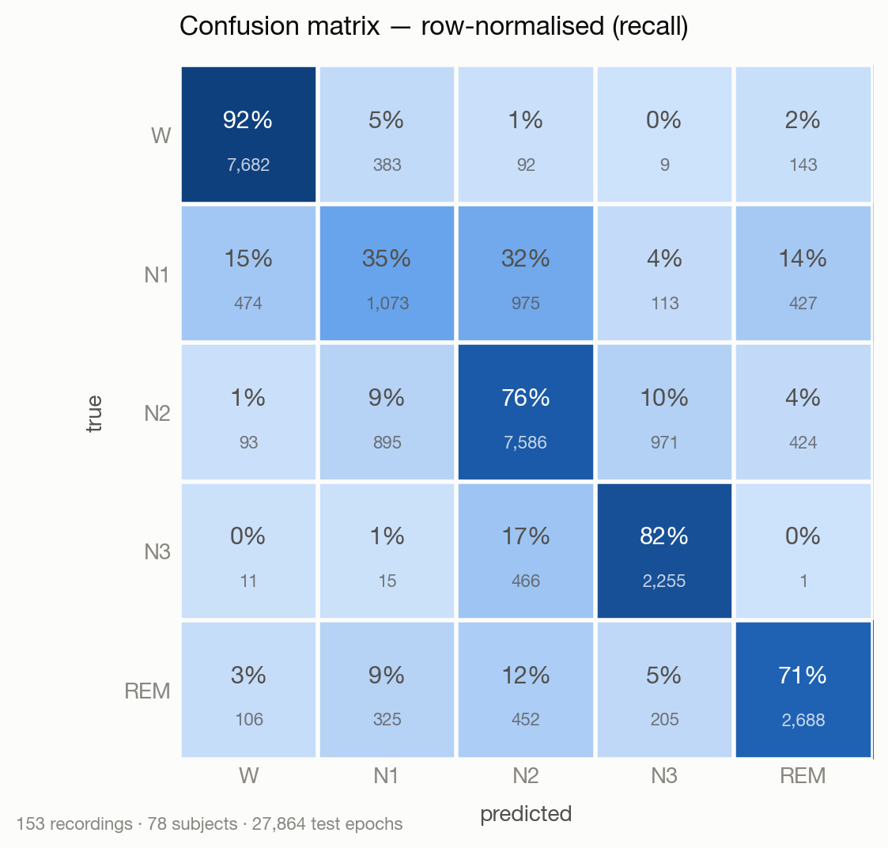
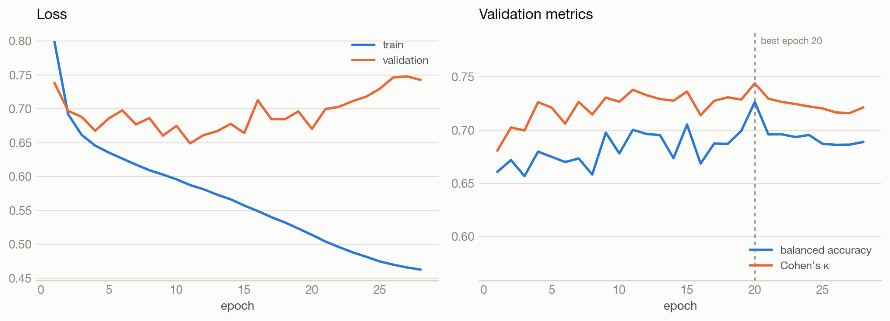

# Results

Full Sleep-EDF Expanded sleep-cassette set: **153 recordings, 78 subjects, 195,469 thirty-second epochs**. Split by subject (54/12/12), so no sleeper appears on more than one side.

## Headline

| metric | measured | reference target |
|---|---|---|
| Cohen's kappa | **0.6837** | 0.683 |
| balanced accuracy | **0.7137** | 0.758 |
| accuracy | 0.7639 | — |
| macro F1 | 0.7015 | — |

**Kappa reproduces the target**: 0.6837 against 0.683.
**Balanced accuracy falls 0.044 short** of 0.758, and that gap is real, not noise —
validation kappa held between 0.716 and 0.730 over the last 8 epochs and balanced
accuracy between 0.686 and 0.696, so the run is stable. Most of the shortfall is N1
(F1 0.373); balanced accuracy is mean per-class recall, so the rarest and most
ambiguous stage drags it directly. Plausible causes not yet tested: longer training (this
stopped at epoch 28, best at 20), or temporal context across neighbouring epochs,
which this single-epoch model has none of.

## Architecture comparison: does temporal context help?

The ResNet scores each 30 s epoch alone. But N1 is *defined* as a transition
stage, and a single epoch of it is genuinely ambiguous even to human scorers —
so the obvious question is whether letting the model see neighbouring epochs
helps, and whether it helps N1 specifically.

`SleepTransformer` keeps a convolutional encoder for waveform features and adds
self-attention across a window of **21 consecutive epochs** (~10.5 min of
context), predicting all 21 at once. Same split, same seed, same class weighting.

| | ResNet (single epoch) | Transformer (21-epoch window) | delta |
|---|---|---|---|
| parameters | 2,468,099 | 3,011,693 | +22% |
| accuracy | 0.7639 | **0.7930** | +0.0291 |
| balanced accuracy | 0.7137 | **0.7488** | +0.0351 |
| Cohen's kappa | 0.6837 | **0.7229** | +0.0393 |
| macro F1 | 0.7015 | **0.7328** | +0.0313 |

<picture>
  <source media="(prefers-color-scheme: dark)" srcset="docs/figures/arch-comparison-dark.png">
  
</picture>

**The gains land exactly where the hypothesis said they would.**

| stage | ResNet | Transformer | delta | |
|---|---|---|---|---|
| W | 0.921 | 0.931 | +0.010 | already easy from one epoch |
| N1 | 0.373 | 0.446 | +0.073 | **a transition stage — most to gain from context** |
| N2 | 0.776 | 0.805 | +0.029 | spindles/K-complexes are local, but stage runs are long |
| N3 | 0.716 | 0.693 | -0.022 | **the only regression** — slow waves are unmistakable in one epoch |
| REM | 0.721 | 0.788 | +0.067 | **hard alone, easy in context** — position in the cycle identifies it |

N1 (+0.073) and REM (+0.067) gain most — the two stages a single 30 s
window cannot pin down. Both are low-amplitude, mixed-frequency and easily
confused with each other in isolation; what separates them is *where they sit in
the night*. N3 is the mirror image: slow waves are unmistakable in one epoch, it
has nothing to gain from neighbours, and it loses 0.022 to the smaller
convolutional encoder the transformer budget pays for.

That pattern — large gains on the context-dependent stages, a small loss on the
one stage that never needed context — is the signature of the mechanism actually
working, rather than a model that is simply bigger.

### Against the reference targets

| metric | ResNet | Transformer | target |
|---|---|---|---|
| Cohen's kappa | 0.6837 | **0.7229** | 0.683 |
| balanced accuracy | 0.7137 | **0.7488** | 0.758 |

The transformer clears the kappa target by 0.040 and closes the balanced-accuracy
gap from 0.044 to 0.009.

## A night, scored and predicted

<picture>
  <source media="(prefers-color-scheme: dark)" srcset="docs/figures/hypnogram-dark.png">
  
</picture>

Test recording SC4412, the **median** of the 24 test recordings by epoch agreement
(the spread is 54.5% to 88.1%) — not the best one. The model recovers the night's
architecture: the early descent into N3, the REM periods lengthening toward morning,
and the wake at both ends. Disagreement clusters at stage transitions, which is also
where human scorers disagree with each other.

## Per stage (test)

| stage | F1 | support |
|---|---|---|
| W | 0.921 | 8,309 |
| N1 | 0.373 | 3,062 |
| N2 | 0.776 | 9,969 |
| N3 | 0.716 | 2,748 |
| REM | 0.721 | 3,776 |

N1 at 0.373 is the weak point, as in all published single-channel work — it is a transition
stage human scorers themselves disagree on. The confusion structure below is physiologically
coherent: N1 scatters into W, N2 and REM; REM is taken for N1 and N2; N3 is confused almost
only with N2, never with wake.

<picture>
  <source media="(prefers-color-scheme: dark)" srcset="docs/figures/per-class-f1-dark.png">
  
</picture>

### Confusion matrix (rows = true, cols = predicted)

<picture>
  <source media="(prefers-color-scheme: dark)" srcset="docs/figures/confusion-matrix-dark.png">
  
</picture>

| | W | N1 | N2 | N3 | REM |
|---|---|---|---|---|---|
| **W** | 7,682 | 383 | 92 | 9 | 143 |
| **N1** | 474 | 1,073 | 975 | 113 | 427 |
| **N2** | 93 | 895 | 7,586 | 971 | 424 |
| **N3** | 11 | 15 | 466 | 2,255 | 1 |
| **REM** | 106 | 325 | 452 | 205 | 2,688 |

## Imbalance handling

Measured over 30 subjects, 15 epochs each. A balanced sampler and a class-weighted loss
correct the same skew, so running both boosts rare stages twice.

| sampler | loss weighting | balanced acc | kappa |
|---|---|---|---|
| `sqrt_inverse` | `effective` | 0.7254 | 0.7103 |
| `none` | `effective` | **0.7215** | **0.7404** |
| `sqrt_inverse` | `none` | 0.7210 | 0.7052 |

Weighted loss alone wins — same balanced accuracy, **+0.030 kappa**. `--sampler-scheme`
therefore defaults to `none`, and the full run above uses weighted loss only.

## Negative control

Identical pipeline, labels shuffled. If this scored above chance there would be leakage:

- balanced accuracy **0.194** (chance 0.200)
- Cohen's kappa **-0.009** (chance 0.000)

## Training

<picture>
  <source media="(prefers-color-scheme: dark)" srcset="docs/figures/training-curves-dark.png">
  
</picture>

Validation loss bottoms around epoch 11 and climbs steadily after — the model is
overfitting by any loss reading. Balanced accuracy and kappa nonetheless keep edging
up to epoch 20, which is where the checkpoint was taken. The two are not in conflict:
the network grows overconfident on epochs it already gets wrong (hurting cross-entropy)
while its argmax decisions still improve slightly. Selecting on loss would have stopped
at epoch 11 and given up that gain.

## Setup

- 2,468,099 parameters, single Fpz-Cz channel, no temporal context between epochs
- device `mps`, batch 128, lr 0.003, AdamW, cosine schedule with warmup
- loss weighting `effective`, sampler `none`, label smoothing 0.05
- trained 28 epochs (early stop, patience 8), best at 20 on validation balanced accuracy
- 133,319 train / 34,286 val / 27,864 test epochs

Raw report: [`results/full153_report.json`](results/full153_report.json)
